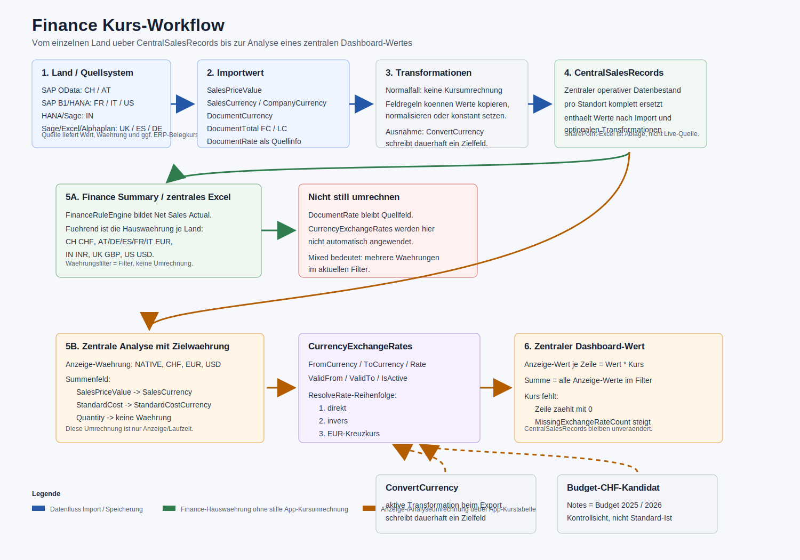
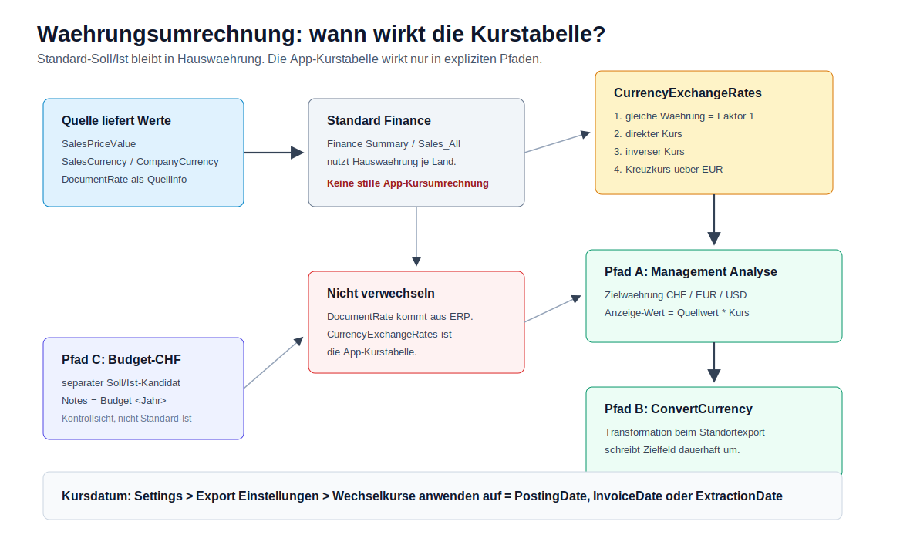

# Finance Kurs-Workflow

Stand: 2026-06-12

Zweck: Diese Doku beschreibt isoliert den Weg eines Umrechnungskurses vom einzelnen Land bis zur Analyse eines zentralen Dashboard-Wertes. Sie ersetzt nicht die allgemeine Finance-Datenflussdoku, sondern schneidet nur das Thema Kurs/Waehrung heraus.
Aktuelle Finance-Schulung: `docs/FINANCE_SCHULUNG_FINANZ_2026-06-11.md`.

Visualisierung: `docs/FINANCE_KURS_WORKFLOW_2026-06-09.svg`
Aktuelle Kurs-/Waehrungsgrafik: `docs/FINANCE_WAEHRUNG_KURSFLUSS_2026-06-11.svg`





## Kurzfazit

- Der Standortimport rechnet Werte normalerweise nicht ueber die App-Kurstabelle um.
- `CentralSalesRecords` speichert die Werte und Waehrungen so, wie sie nach Import und optionalen Transformationen vorliegen.
- Wenn Audit-CSV als zentrale Auswertungsquelle aktiv ist, enthalten die `Sales_ProcessedMergeInput_*.csv` dieselben verarbeiteten Werte nach Mapping und Transformation.
- `DocumentRate` ist ein Quellfeld aus SAP/B1/OData, kein automatisch angewendeter App-Kurs.
- Die fuehrende `Finance Summary` und das zentrale Excel nutzen Hauswaehrung je Land. Die App-Kurstabelle wird dort nicht still angewendet.
- Eine echte App-Umrechnung passiert nur in Analyse-/Anzeige-Sichten mit Zielwaehrung, in einer expliziten `ConvertCurrency`-Transformation oder im separaten Budget-CHF-Kandidaten.
- Wenn in einer Zielwaehrung kein Kurs gefunden wird, fliesst diese Zeile mit `0` in die Anzeige-Summe ein und wird als fehlender Kurs gezaehlt.

## Begriffe

| Begriff | Bedeutung |
| --- | --- |
| Hauswaehrung | Fuehrende Finance-Waehrung des Landes, z. B. `EUR`, `CHF`, `GBP`, `USD`, `INR`. |
| `SalesCurrency` | Waehrung von `SalesPriceValue`; fuer Dashboard-Umrechnung die wichtigste Quellwaehrung. |
| `CompanyCurrency` | lokale Firmen-/Hauswaehrung aus dem Quellsystem, soweit vorhanden. |
| `DocumentCurrency` | Belegwaehrung, z. B. Fremdwaehrung eines einzelnen Kundenbelegs. |
| `DocumentRate` | Belegkurs aus dem ERP-Quellsystem. Wird gespeichert, aber nicht automatisch fuer Dashboard-Umrechnung verwendet. |
| App-Kurstabelle | Tabelle `CurrencyExchangeRates` mit `FromCurrency`, `ToCurrency`, `Rate`, `ValidFrom`, `ValidTo`, `Notes`, `IsActive`. |
| Anzeige-Waehrung | Zielwaehrung in Analyse-Sichten, aktuell `NATIVE`, `CHF`, `EUR`, `USD`. |
| Budgetkurs | Kurs mit `Notes = Budget <Jahr>`, z. B. `Budget 2025`, fuer separaten CHF-Kontrollkandidaten. |
| Audit-CSV | Verarbeitete Standort-CSV `Sales_ProcessedMergeInput_<TSC>_<Datum>.csv`; optional zentrale Quelle fuer Dashboard und zentrale Excel. |

## Gesamtfluss

```text
Land / Quellsystem
  |
  +-- Werte und Waehrungen lesen
  |     SalesPriceValue, SalesCurrency, CompanyCurrency,
  |     DocumentCurrency, DocumentTotal FC/LC, DocumentRate
  |
  +-- optionale FieldTransformationRules
  |     normal: keine Kursumrechnung
  |     Ausnahme: ConvertCurrency schreibt dauerhaft ein Zielfeld
  |
  +-- Standort-Excel schreiben
  |
  +-- optional Audit-CSV schreiben
  |     Sales_ProcessedMergeInput_<TSC>_<Datum>.csv
  |
  +-- CentralSalesRecords fuer Standort ersetzen
  |
  +-- zentrale Auswertungsquelle
  |     Standard: CentralSalesRecords
  |     optional: neueste Audit-CSV je TSC
  |
  +-- zentrale Excel / Finance Summary
  |     Hauswaehrung, keine stille App-Kursumrechnung
  |
  +-- Management Analyse / Rohdaten-Diagnose mit Zielwaehrung
        Kurstabelle suchen -> Betrag * Kurs -> zentrale Anzeige-Summe
```

## Schritt 1: Land liefert Betrag und Waehrung

Jedes Land liefert zuerst einen Nettowert und die dazugehoerige Waehrungsinformation. Der Kurs selbst wird dabei nur als Quellinformation uebernommen, nicht automatisch angewendet.

| Land / TSC | Quelle | Fuehrender Importwert | Waehrungsfelder | Kursfeld aus Quelle |
| --- | --- | --- | --- | --- |
| CH / AT `ZSCHWEIZ` | SAP OData | `Z.NetwrHc` -> `SalesPriceValue` | `Z.Hwaer` -> `SalesCurrency` / `CompanyCurrency`, `Z.Waerk` -> `DocumentCurrency` | `Z.Kurrf` -> `DocumentRate` |
| FR `TRFR` | SAP B1/HANA | `INV1.LineTotal`, Credit Notes negativ | `OADM.MainCurncy`, `OINV.DocCur` | `OINV.DocRate` / `ORIN.DocRate` |
| IT `TRIT` | SAP B1/HANA | `INV1.LineTotal`, Credit Notes negativ, mit IT-Filter | `OADM.MainCurncy`, `DocCur` | `DocRate` |
| US `TRUS` | SAP B1/HANA | `INV1.LineTotal`, Credit Notes negativ | `OADM.MainCurncy`, `DocCur` | `DocRate` |
| IN `TRIN` | HANA/Sage-Quelle | Hauswaehrungswert in INR | Finance-Hauswaehrung `INR` | ggf. Quellkurs, nicht fuehrend fuer Soll/Ist |
| UK `TRUK` | Sage/Manual Excel | `[Sales Price/Value] * [Quantity]` | `GBP` | kein App-Kurs beim Import |
| ES `TRES` | Sage CSV | `ImporteNeto`, REC/Credit negativ | `EUR` | kein App-Kurs beim Import |
| DE `TRDE` | Alphaplan CSV-Paar `invoice_headers.csv`/`invoice_lines.csv` | `NettoPreisGesamt` | aktuell fachlich `EUR` | kein App-Kurs beim Import |

Wichtig: Ein vorhandener ERP-Belegkurs erklaert die Beziehung zwischen Belegwaehrung und lokaler Hauswaehrung im Quellsystem. Die App nutzt fuer die zentrale Anzeigeumrechnung trotzdem die eigene Kurstabelle, sobald eine Zielwaehrung gewaehlt wird.

## Schritt 2: Kurstabelle pflegen

Die App-Kurse liegen in `CurrencyExchangeRates`.

Pflegeorte:

- `Settings > Wechselkurse`: Kurse manuell erfassen, aktivieren/deaktivieren und speichern.
- `Refresh Kurse`: importiert ECB-Tageskurse als `EUR -> <Waehrung>` mit Notiz `ECB daily reference rate`.
- Seed beim App-Start: Budgetkurse fuer `Budget 2025` und `Budget 2026`, jeweils zur Umrechnung in `CHF`.
- Konfigurationsexport/-import: Kurse sind Teil des Config-Transferpakets.

Technische Regeln beim Speichern:

- Waehrungscodes werden getrimmt und in Grossbuchstaben gespeichert.
- Leere Waehrungen und Kurse `<= 0` werden verworfen.
- `ValidFrom` und `ValidTo` werden auf Datum ohne Uhrzeit normalisiert.

## Schritt 3: Kurs aufloesen

Die zentrale Kursaufloesung laeuft ueber `CurrencyExchangeRateService.ResolveRate(from, to, date)`.

Reihenfolge:

1. Waehrungscodes normalisieren, z. B. `$` -> `USD`, `SFR` -> `CHF`, `RS` -> `INR`.
2. Gleiche Waehrung ergibt Kurs `1`.
3. Wirksames Datum bestimmen. Ohne Datum wird das heutige UTC-Datum verwendet.
4. Direkten aktiven Kurs suchen: `FromCurrency = Quelle`, `ToCurrency = Ziel`, Datum innerhalb `ValidFrom`/`ValidTo`.
5. Wenn kein direkter Kurs existiert: inversen Kurs suchen und `1 / Rate` rechnen.
6. Wenn weiterhin kein Kurs existiert: Kreuzkurs ueber `EUR` suchen.
7. Wenn nichts passt: Ergebnis `null`.

Bei mehreren gueltigen Kursen gewinnt der mit dem neuesten `ValidFrom`.

## Schritt 4: Standortexport und zentrale Tabelle

Beim normalen Standortexport gilt:

```text
Daten holen
  -> Transformationen anwenden
  -> optional Audit-CSV Sales_ProcessedMergeInput_*.csv schreiben
  -> Standort-Excel schreiben
  -> CentralSalesRecords fuer diesen Standort ersetzen
  -> optional SharePoint Upload
```

Ohne aktive `ConvertCurrency`-Transformation passiert keine App-Kursumrechnung. `CentralSalesRecords` erhaelt:

- den Importwert `SalesPriceValue`,
- die zugehoerige `SalesCurrency`,
- Belegfelder wie `DocumentCurrency`, `DocumentTotalForeignCurrency`, `DocumentTotalLocalCurrency`, `DocumentRate`,
- die Datumsfelder `PostingDate`, `InvoiceDate`, `ExtractionDate`.

Damit bleibt nachvollziehbar, ob ein Wert bereits vom Landessystem als Hauswaehrungswert geliefert wurde oder ob er spaeter nur in der Anzeige umgerechnet wurde.

Die Audit-CSV wird an derselben Stelle im Ablauf geschrieben: nach Mapping/Transformation und vor der zentralen Auswertung. Sie ist deshalb fuer Finance/Revision das lesbare Abbild des verarbeiteten Merge-Eingangs, nicht das originale Standortfile.

## Schritt 5: Fuehrende Finance Summary

Die fuehrende Finance Summary im Dashboard und das zentrale Excel-Blatt `Finance Summary` rechnen nicht automatisch in eine globale Zielwaehrung um.

Logik:

```text
zentrale Auswertungsquelle
  Standard: CentralSalesRecords
  optional: Sales_ProcessedMergeInput_*.csv
  -> FinanceRuleEngine
  -> Finance | Net Sales Actual
  -> Gruppierung nach Jahr, Land, Finance-Waehrung
```

Die Finance-Waehrung ist je Land fest bzw. aus dem Hauswaehrungskontext bestimmt:

| Land | Finance-Waehrung |
| --- | --- |
| CH | CHF |
| AT | EUR |
| DE | EUR |
| ES | EUR |
| FR | EUR |
| IN | INR |
| IT | EUR |
| UK | GBP |
| US | USD |

Der Waehrungsfilter in `Finance Summary` ist deshalb ein Filter auf diese vorhandene Finance-Waehrung. Er ist keine Umrechnung.

Konsequenz:

- `Finance Summary` mit Filter `GBP` zeigt UK-Werte in GBP.
- `Finance Summary` mit mehreren Laendern kann `Mixed` anzeigen.
- Es wird dabei kein EUR/GBP/CHF-Kurs aus `CurrencyExchangeRates` angewendet.

## Schritt 6: Zentrale Analyse mit Anzeige-Waehrung

Die Kursanwendung fuer einen zentralen Dashboard-Wert passiert in der Management-Analyse der zentralen Rohdaten, wenn eine Anzeige-Waehrung gewaehlt ist.

Eingaben:

- Datenbasis: zentrale Auswertungsquelle, also `CentralSalesRecords` oder bei aktivem Audit-Modus die neuesten `Sales_ProcessedMergeInput_*.csv` je TSC.
- Summenfeld: z. B. `SalesPriceValue`, `StandardCost`, `StandardCostTotal`, `Quantity`.
- Anzeige-Waehrung: `NATIVE`, `CHF`, `EUR` oder `USD`.
- Zeitraum/Filter: Jahr, Monat, Land, TSC.

Waehrungsquelle je Summenfeld:

| Summenfeld | Waehrung fuer Kurs |
| --- | --- |
| `SalesPriceValue` | `SalesCurrency` |
| `StandardCost` | `StandardCostCurrency` |
| `StandardCostTotal` | `StandardCostCurrency` |
| `Quantity` | keine Waehrung; Anzeige-Waehrung wird ignoriert |

Datumswahl fuer zentrale Analyse:

| Setting `ExchangeRateDateField` | Kursdatum |
| --- | --- |
| `PostingDate` | `PostingDate`, sonst `InvoiceDate`, sonst `ExtractionDate` |
| `InvoiceDate` | `InvoiceDate`, sonst `PostingDate`, sonst `ExtractionDate` |
| `ExtractionDate` | `ExtractionDate` |

Formel bei Zielwaehrung:

```text
Anzeige-Wert je Zeile = Quellwert * ResolveRate(Quellwaehrung, Zielwaehrung, Kursdatum)
Zentraler Dashboard-Wert = Summe aller Anzeige-Werte im Filter
```

Sonderfaelle:

- Zielwaehrung `NATIVE`: keine Umrechnung; Werte bleiben in ihrer Quellwaehrung.
- Quellwaehrung gleich Zielwaehrung: Faktor `1`.
- Kurs fehlt: Anzeige-Wert dieser Zeile wird `0`, `MissingExchangeRateCount` steigt.
- Mehrere native Waehrungen im Ergebnis: Anzeige `Mixed`.

Diese Umrechnung ist eine Laufzeit-Anzeige. Sie aendert `CentralSalesRecords`, Standort-Excel und zentrales Excel nicht.

## Schritt 7: Explizite Transformation `ConvertCurrency`

Nur wenn eine aktive `FieldTransformationRule` mit `TransformationType = ConvertCurrency` existiert, wird beim Standortexport dauerhaft ein Feld umgerechnet.

Beispielargument:

```text
amountField=SalesPriceValue;
currencyField=SalesCurrency;
targetCurrency=EUR;
dateField=InvoiceDate;
targetCurrencyField=SalesCurrency;
round=2
```

Wirkung:

- Quelle und Ziel werden ueber die App-Kurstabelle aufgeloest.
- `TargetField` erhaelt den umgerechneten Betrag.
- Optional wird ein Ziel-Waehrungsfeld gesetzt.
- Diese Veraenderung liegt danach in Standort-Excel und `CentralSalesRecords`.

Fallback-Datum in `ConvertCurrency`:

```text
konfiguriertes dateField
  sonst InvoiceDate
  sonst OrderDate
  sonst ExtractionDate
```

Damit ist `ConvertCurrency` ein anderer Pfad als die Anzeige-Waehrung in der zentralen Analyse.

## Schritt 8: Budget-CHF-Kandidat

Im Soll/Ist-Vergleich gibt es einen separaten Kandidaten:

```text
Nettofakturawert Hauswaehrung -> CHF Budget <Jahr>
```

Dieser Kandidat nutzt nur Kurse mit:

```text
Notes = Budget 2025
Notes = Budget 2026
```

Er ist eine Kontroll-/Reporting-Sicht. Er ersetzt nicht den Standardabgleich in Hauswaehrung.

## Analysepfad fuer eine konkrete Kursfrage

Wenn ein zentraler Wert im Dashboard wegen Kursen geprueft werden soll:

1. Land/TSC und Quellwert pruefen: `SalesPriceValue`, `SalesCurrency`, `CompanyCurrency`, `DocumentCurrency`, `DocumentRate`.
2. Klaeren, welche Dashboard-Sicht gemeint ist:
   - `Finance Summary`: keine App-Kursumrechnung, nur Waehrungsfilter.
   - zentrale Rohdaten-/Management-Analyse mit Anzeige-Waehrung: App-Kursumrechnung.
   - `ConvertCurrency`: dauerhafte Transformation beim Export.
3. In den Settings das Kursdatum pruefen: `PostingDate`, `InvoiceDate` oder `ExtractionDate`.
4. In `CurrencyExchangeRates` den gueltigen Kurs zum Datum suchen.
5. Direkte, inverse und EUR-Kreuzkurslogik beachten.
6. Im Dashboard `Nicht umgerechnet` / `MissingExchangeRateCount` kontrollieren.
7. Falls `Mixed` angezeigt wird, wurde nicht in eine einheitliche Zielwaehrung gerechnet.

Hilfsabfragen fuer SQLite:

```sql
SELECT Land, Tsc, SalesCurrency, CompanyCurrency, DocumentCurrency,
       COUNT(*) AS Rows,
       SUM(SalesPriceValue) AS SalesValue
FROM CentralSalesRecords
GROUP BY Land, Tsc, SalesCurrency, CompanyCurrency, DocumentCurrency
ORDER BY Land, Tsc;
```

```sql
SELECT FromCurrency, ToCurrency, Rate, ValidFrom, ValidTo, Notes, IsActive
FROM CurrencyExchangeRates
WHERE IsActive = 1
ORDER BY FromCurrency, ToCurrency, ValidFrom DESC;
```

## Code-Stellen

| Thema | Code |
| --- | --- |
| Kursmodell | `Models/CurrencyExchangeRate.cs` |
| Kursaufloesung | `Services/CurrencyExchangeRateService.cs` |
| ECB-Import | `Services/ExchangeRateImportService.cs` |
| Settings/Kurspflege | `Services/SettingsPageService.cs`, `Components/Pages/Settings.razor` |
| Standortexport-Reihenfolge | `Services/SiteExportService.cs` |
| Audit-CSV schreiben/lesen | `Services/ExportAuditCsvService.cs` |
| zentrale Quelle DB oder CSV | `Services/CentralSalesDataProvider.cs` |
| zentrale Speicherung | `Services/CentralSalesRecordService.cs` |
| zentrale Analyse mit Zielwaehrung | `Services/ManagementCockpitService.cs` |
| Finance Summary ohne stille Umrechnung | `Services/ManagementCockpitService.cs`, `Services/ExcelExportService.cs` |
| Budget-CHF-Kandidat | `Services/FinanceReconciliationService.cs` |
| ConvertCurrency | `Services/TransformationStrategies.cs` |

## Nicht verwechseln

| Nicht verwechseln | Klarstellung |
| --- | --- |
| `DocumentRate` vs. App-Kurstabelle | `DocumentRate` kommt aus dem Landessystem; App-Umrechnung nutzt `CurrencyExchangeRates`. |
| Finance-Waehrungsfilter vs. Anzeige-Waehrung | Finance-Waehrungsfilter filtert vorhandene Hauswaehrungen; Anzeige-Waehrung rechnet Werte um. |
| Zentrale Excel vs. Dashboard-Livewert | Die App-Anzeige liest `CentralSalesRecords`; SharePoint-Excel ist Ergebnis/Ablage. |
| Budget-CHF vs. Tageskurs | Budgetkurse sind eigene Kontrollkurse, nicht automatisch der Standard-Ist. |
| Native/Mixed vs. konvertiert | `NATIVE` summiert je Quellwaehrung; `Mixed` heisst mehrere Waehrungen im Ergebnis. |
