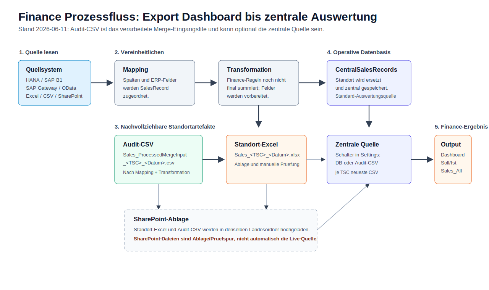
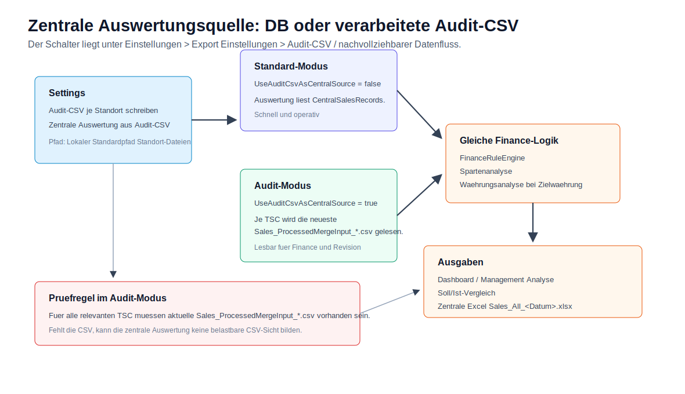

# Finance Schulung fuer Finance-Anwender

Stand: 2026-06-17

Zweck: Diese Schulungsunterlage beschreibt den aktuellen Finance-Prozess vom Standortexport bis zu Dashboard, zentraler Excel und Soll/Ist-Vergleich. Sie ist fuer Finance, Finance Keyuser und Wirtschaftspruefung gedacht.

## Prozessgrafiken

Die folgenden Grafiken zeigen die wichtigsten Zusammenhaenge vor den Detailkapiteln:






## Kurzfazit

- Fuehrende Sicht fuer Soll/Ist ist `Finance Summary` bzw. der Soll/Ist-Vergleich.
- Das zentrale Excel ist ein Ergebnis des aktuellen Datenbestands, nicht die Live-Quelle des Dashboards.
- Standortexporte schreiben optional eine nachvollziehbare Audit-CSV nach Mapping und Transformation.
- Die Audit-CSV heisst `Sales_ProcessedMergeInput_<TSC>_<yyyy-MM-dd>.csv` und ist das verarbeitete Merge-Eingangsfile, nicht das originale Standortfile.
- Per Einstellung kann die zentrale Auswertung von `CentralSalesRecords` auf die neuesten Audit-CSV je Standort umgeschaltet werden.
- `Zentrale Datei neu erzeugen` schreibt neben `Sales_All_<Datum>.xlsx` auch `Finance_Dashboard_Nachweis_<Datum>.xlsx` und `Finance_Dashboard_Audit_All_<Datum>.csv`.
- Die zentralen Finance-Dateien werden nach SharePoint `Import/Finance/Alle` hochgeladen; Standortdateien bleiben in den jeweiligen Laenderordnern.
- `Management Analyse > Experten` enthaelt zusaetzlich `Gruppenmarge` und in der `3D Datenanalyse` die Diagrammart `Sparten-Kreis je Land`.
- Waehrungsumrechnung passiert nicht still im Standard-Ist. Sie passiert nur in klaren Analyse-/Transformationsfaellen.
- Deutschland/Alphaplan liest jetzt `invoice_headers.csv` + `invoice_lines.csv`; Full und `delta` werden zusammengesetzt und dedupliziert.
- Alphaplan `ArtikelNummer` ist eine lokale Artikelnummer und nicht automatisch eine TR-AG-/SAP-`MATNR`.

## Rollen

| Rolle | Aufgabe |
| --- | --- |
| Finance Anwender | Finance Summary, zentrale Excel und Soll/Ist pruefen |
| Finance Keyuser | Standortexporte starten, Audit-CSV kontrollieren, Freigabe vorbereiten |
| Wirtschaftspruefung | Datenfluss ueber verarbeitete CSV, zentrale Excel und Detailzeilen nachvollziehen |
| Admin / IT | Standorte, Quellen, Mappings, Kurse, SharePoint und Regeln pflegen |

## Prozessfluss: Export bis Dashboard

```text
Quellsystem oder Standortdatei
  |
  +-- Export Dashboard: Standort exportieren
        |
        +-- Adapter liest Daten
        |     HANA/B1, SAP Gateway/OData oder Manual Excel/CSV/SharePoint
        |
        +-- Mapping ins SalesRecord-Modell
        |
        +-- Transformationen anwenden
        |     z. B. Feldkopien, FirstNonEmpty, optional ConvertCurrency
        |
        +-- Audit-CSV schreiben, falls aktiv
        |     Sales_ProcessedMergeInput_<TSC>_<Datum>.csv
        |
        +-- Standort-Excel schreiben
        |     Sales_<TSC>_<Datum>.xlsx
        |
        +-- CentralSalesRecords fuer diesen Standort ersetzen
        |
        +-- Standort-Excel und Audit-CSV nach SharePoint hochladen, falls konfiguriert

Zentrale Auswertungsquelle
  |
  +-- Standard: CentralSalesRecords
  |
  +-- Optional: neueste Sales_ProcessedMergeInput_*.csv je TSC
        |
        +-- Finance Summary / Management Analyse
        +-- Soll/Ist-Vergleich
        +-- Zentrale Excel Sales_All_<Datum>.xlsx
        +-- Dashboard-Nachweis Finance_Dashboard_Nachweis_<Datum>.xlsx
        +-- Zentrale Audit-CSV Finance_Dashboard_Audit_All_<Datum>.csv
```

Wichtig fuer Finance: Der Standortexport schreibt zuerst die verarbeiteten Daten. Danach entscheidet die Einstellung `Zentrale Auswertung aus Audit-CSV`, ob Dashboard und zentrale Excel aus der internen DB oder aus den neuesten verarbeiteten CSV-Dateien lesen.

## Schalter in der App

Die Schalter liegen unter:

```text
Einstellungen > Export Einstellungen > Audit-CSV / nachvollziehbarer Datenfluss
```

| Feld | Wirkung |
| --- | --- |
| `Lokaler Standardpfad Standort-Dateien` | Ordner fuer Standort-Excel und Audit-CSV. Wenn leer, wird `output` im App-Verzeichnis verwendet. |
| `Audit-CSV je Standort schreiben` | Schreibt beim Laenderexport je Standort eine verarbeitete CSV. |
| `Zentrale Auswertung aus Audit-CSV` | Dashboard, zentrale Excel und Finance-Auswertungen lesen die neuesten Audit-CSV statt der internen DB. |
| `Wechselkurse anwenden auf` | Datumsfeld fuer Kursgueltigkeit in Management-Analysen: `PostingDate`, `InvoiceDate` oder `ExtractionDate`. |

Es gibt keinen separaten sichtbaren Audit-CSV-Pfad. Die Audit-CSV liegt bewusst im gleichen Ordner wie die lokalen Standortdateien und wird beim Standortexport in den gleichen SharePoint-Landesordner hochgeladen.

## Dateinamen und Bedeutung

| Datei | Bedeutung |
| --- | --- |
| `Sales_<TSC>_<yyyy-MM-dd>.xlsx` | Standort-Excel fuer Menschen und Ablage. |
| `Sales_ProcessedMergeInput_<TSC>_<yyyy-MM-dd>.csv` | Verarbeitetes Standortfile nach Mapping und Transformation; Eingang fuer Merge/zentrale Auswertung, auditierbar. |
| `Sales_All_<yyyy-MM-dd>.xlsx` | Zentrale Excel mit Finance Summary, Finance Details und Sales-Blatt. |
| `Finance_Dashboard_Nachweis_<yyyy-MM-dd>.xlsx` | Nachweis-Excel fuer Finance/Andreas mit Formel-Summaries und Detailblaettern. |
| `Finance_Dashboard_Audit_All_<yyyy-MM-dd>.csv` | Zentrale Audit-/Nachweis-CSV aller Laender mit aufbereiteten Merge-Feldern inkl. Produktsparte. |

Die Audit-CSV ist nicht das originale Standortfile aus Sage, Alphaplan, HANA oder SAP. Sie ist das bereits verarbeitete File, das fachlich erklaert, welche Zeilen in den zentralen Merge gehen.

Wichtig: Die zentrale Datei `Finance_Dashboard_Audit_All_<Datum>.csv` nutzt bewusst kein `Sales_*`-Praefix. Dadurch wird sie nicht erneut als TSC-/Laender-Input fuer die zentrale Auswertung eingelesen.

## Zentrale Auswertungsquelle

### Standard: interne DB

Im Standard liest die App aus `CentralSalesRecords`.

```text
Standortexport
  -> CentralSalesRecords fuer Standort ersetzen
  -> Dashboard und zentrale Excel lesen CentralSalesRecords
```

Das ist die schnellste operative Variante.

### Audit-Modus: CSV als zentrale Quelle

Wenn `Zentrale Auswertung aus Audit-CSV` aktiv ist:

```text
Ordner mit Sales_ProcessedMergeInput_*.csv
  -> je TSC die neueste Datei suchen
  -> CSV lesen
  -> Dashboard, zentrale Excel und Soll/Ist daraus bilden
```

Das ist die nachvollziehbare Variante fuer Finance/Revision. Finance kann die CSV-Dateien oeffnen, summieren und gegen die zentrale Excel pruefen.

Kontrollregel: Wenn der Audit-Modus aktiv ist, muessen fuer alle relevanten Standorte aktuelle `Sales_ProcessedMergeInput_*.csv` im Standort-Exportordner vorhanden sein.

## Waehrungsumrechnung

Die Kurstabelle liegt in der App unter:

```text
Einstellungen > Wechselkurse
```

Technisch ist das die Tabelle `CurrencyExchangeRates` mit:

| Feld | Bedeutung |
| --- | --- |
| `FromCurrency` | Quellwaehrung |
| `ToCurrency` | Zielwaehrung |
| `Rate` | Faktor: Betrag * Rate |
| `ValidFrom` / `ValidTo` | Gueltigkeitszeitraum |
| `Notes` | z. B. `Budget 2025`, `Budget 2026`, `ECB daily reference rate` |
| `IsActive` | nur aktive Kurse werden verwendet |

Die App sucht Kurse so:

1. gleiche Waehrung ergibt Faktor `1`.
2. direkter Kurs `Quelle -> Ziel`.
3. falls fehlt: inverser Kurs `Ziel -> Quelle`, gerechnet als `1 / Rate`.
4. falls fehlt: Kreuzkurs ueber `EUR`.
5. falls weiterhin fehlt: keine Umrechnung; die Anzeige zaehlt fehlende Kurse.

## Wo Kurse wirken

| Bereich | Kurswirkung |
| --- | --- |
| Standard `Finance Summary` | keine stille Umrechnung; Hauswaehrung je Land bleibt fuehrend |
| Zentrale Excel `Finance Summary` / `Finance Details` | keine stille globale Zielwaehrung |
| Management Analyse mit Zielwaehrung `CHF`, `EUR`, `USD` | App rechnet zur Anzeige ueber `CurrencyExchangeRates` um |
| Transformation `ConvertCurrency` | schreibt beim Standortexport dauerhaft ein Zielfeld um |
| Soll/Ist-Kandidat `Nettofakturawert Hauswaehrung -> CHF Budget <Jahr>` | nutzt Kurse mit `Notes = Budget <Jahr>` als separate Kontrollsicht |
| ERP-Feld `DocumentRate` | gespeicherte Quellinformation, nicht automatisch die App-Umrechnung |

Die Standardfreigabe erfolgt zuerst in lokaler Hauswaehrung. Eine CHF- oder EUR-Sicht ist eine separate Reporting-/Analysefrage.

## Datumsfeld fuer Kurse

In `Einstellungen > Export Einstellungen` bestimmt `Wechselkurse anwenden auf`, welches Datum fuer die Kursgueltigkeit verwendet wird:

| Einstellung | Kursdatum |
| --- | --- |
| `PostingDate` | `PostingDate`, sonst `InvoiceDate`, sonst `ExtractionDate` |
| `InvoiceDate` | `InvoiceDate`, sonst `PostingDate`, sonst `ExtractionDate` |
| `ExtractionDate` | `ExtractionDate` |

Diese Einstellung betrifft Management-Analysen mit Zielwaehrung. Sie aendert nicht die Rohdaten und nicht die normalen Standort-Exporte.

## Zentrale Excel

Die zentrale Excel wird ueber das Export Dashboard erzeugt:

```text
Export Dashboard > Zentrale Datei neu erzeugen
```

Dabei entstehen typischerweise drei zentrale Dateien:

| Datei | Zweck |
| --- | --- |
| `Sales_All_<Datum>.xlsx` | operative zentrale Excel aus dem aktuellen Datenbestand |
| `Finance_Dashboard_Nachweis_<Datum>.xlsx` | Excel-Nachweis mit Formeln und Detailblaettern |
| `Finance_Dashboard_Audit_All_<Datum>.csv` | zentrale Audit-CSV aller Laender mit Sparten-/Merge-Feldern |

`Sales_All_<Datum>.xlsx` enthaelt typischerweise:

| Blatt | Zweck |
| --- | --- |
| `Finance Summary` | Summen nach Jahr, Land und Waehrung |
| `Finance Details` | Detailzeilen, die in die Finance Summary eingehen |
| `Sales` | vollstaendige verarbeitete Exportdaten |
| `Finance Filter Hilfe` | Hinweise fuer Excel-Filter |

Wenn die zentrale Auswertungsquelle auf Audit-CSV steht, wird die zentrale Excel aus den neuesten Audit-CSV gebildet. Wenn die Auswertungsquelle auf DB steht, wird sie aus `CentralSalesRecords` gebildet.

Das Nachweis-Excel `Finance_Dashboard_Nachweis_<Datum>.xlsx` enthaelt Formel-Summaries wie `SUMIFS`, `COUNTIFS` und `IF`. Finance kann damit nachvollziehen, wie Summen aus Detailzeilen entstehen. Enthalten sind u. a. Finance, Soll/Ist, Sparten, Gruppenmarge und Datenqualitaet.

Wenn SharePoint konfiguriert ist, landen die zentralen Dateien in `Import/Finance/Alle`. Die Standortdateien `Sales_<TSC>_*` und `Sales_ProcessedMergeInput_<TSC>_*` bleiben je Standort im jeweiligen Laenderordner.

## Soll/Ist-Vergleich

Der Soll/Ist-Vergleich nutzt dieselbe Finance-Logik wie Finance Summary und zentrale Excel.

| Feld | Bedeutung |
| --- | --- |
| `Ist` | aktueller Finance-Istwert |
| `Referenz` | Soll-/check.xlsx-Wert bzw. FinanceReference |
| `Differenz` | Ist minus Referenz |
| `Varianten` | alternative technische Berechnungskandidaten |
| `IC` | Intercompany-/2nd-party-Diagnose, nicht stiller Abzug |

Wenn im Expertenmodus Varianten angezeigt werden, muss der Sollwert weiterhin sichtbar bleiben, weil Finance die Differenz nur mit Referenzwert beurteilen kann.

## Management Analyse und Experten

Die Management Analyse ist eine Diagnose- und Plausibilitaetssicht. Sie ist nicht die fuehrende Abschlusszahl; fuer Soll/Ist bleibt `Finance Summary` bzw. der Soll/Ist-Vergleich fuehrend.

Aktuelle Expertenbereiche:

| Bereich | Zweck |
| --- | --- |
| `Finance Summary` | KPI-Karten und Summen wie im zentralen Excel |
| `Laender` | Ist, IC/2nd-party, Ist ohne IC, Soll, Differenz, Status und Quelle je Land |
| `Datenstatus` | Standortbestand, letzte Speicherung, letzter Export und Importhinweise |
| `Abweichungen` | groesste Soll/Ist-Abweichungen |
| `Gutschriften` | technische Kandidaten ueber negative Werte und Belegtypen |
| `Datenqualitaet` | fehlende Materialnummern, Produktgruppen, Waehrungen, Kunden, Datum, Nullwerte |
| `Spartenanalyse > Finanzanalyse` | Umsatzabdeckung und Umsatz nach Produktsparte/Familie/PAPH1 |
| `Spartenanalyse > Zentrale Zuordnung` | Materialnummern aller Laender gegen TR-AG-/SAP-Stamm |
| `Gruppenmarge` | Pruefsicht fuer Umsatz, bekannte Kostenbasis, offene Kostenbasis und Marge |
| `3D Datenanalyse` | interaktive Analyse; inkl. `Sparten-Kreis je Land` als Tortendiagramm je Land |

## Gruppenmarge

`Gruppenmarge` ist aktuell eine Pruefsicht, kein final freigegebener Finance-Abschlusswert.

Die Sicht zeigt:

| Feld | Bedeutung |
| --- | --- |
| Umsatz | aktueller Umsatz aus der zentralen Finance-Datenbasis |
| Bekannte Kostenbasis | Kostenanteil, der aus Standardpreis/interner Kostenlogik ermittelt werden kann |
| Offen | Zeilen mit fehlendem Standardpreis oder unklarer Lieferanten-/Kostenbasis |
| Marge / % | wird nur belastbar angezeigt, wenn keine offenen Kostenzeilen vorhanden sind |

Wichtig: Eine leere oder fehlende Kostenbasis darf nicht als 100%-Marge interpretiert werden. Wenn offene Kostenbasis vorhanden ist, zeigt die App Marge und Prozent bewusst als `-`.

Offene Fachentscheide fuer Andreas/Finance sind im Multiple-Choice-Dokument dokumentiert:

```text
docs/FINANCE_GRUPPENMARGE_MULTIPLE_CHOICE_2026-06-16.docx
```

## Laenderlogik kurz

| Land | Quelle / Logik |
| --- | --- |
| CH / AT | SAP Gateway/OData `ZSCHWEIZ`, `NetwrHc`, Spartenreferenz aus `ProductDivisionRefSet` |
| DE | Alphaplan CSV-Paar, Full + `delta`, `NettoPreisGesamt`, CreditNote/GS negativ |
| ES | Sage CSV, Basis plus Range-/Delta-Dateien, `ImporteNeto`, REC/Abono/Credit negativ |
| FR | SAP B1/HANA, Rechnungen und Gutschriften als Positions-Netto |
| IN | SAGE/HANA `TRIN`, Hauswaehrung INR |
| IT | SAP B1/HANA, IT-Abgrenzung mit `Trafag Italia` und Blank-Supplier-Deduplizierung |
| UK | Sage/Manual Excel, Jahresdatei plus Delta-Dateien, `[Sales Price/Value] * [Quantity]`, Credit Notes negativ |
| US | SAP B1/HANA, Positions-Netto in USD |

## Schulungsbeispiele: 4 Zeilen je Land

Die folgenden Zahlen sind bewusst kleine Schulungssamples, keine produktiven Ist-Werte. Sie zeigen den Fluss:

```text
Quellzeile
  -> Mapping / Transformation beim Standortexport
  -> Sales_ProcessedMergeInput_<TSC>_<Datum>.csv oder CentralSalesRecords
  -> FinanceRuleEngine
  -> Finance Summary / Finance Details im zentralen Excel
  -> Dashboard / Soll-Ist
```

### Wo die Transformation wirkt

Transformationen wirken beim Standortexport, nachdem die Quelle gelesen und bevor Audit-CSV, Standort-Excel und zentrale Datenbasis geschrieben werden.

```text
Quelle lesen
  -> Mapping in SalesRecord
  -> FieldTransformationRules anwenden
  -> Audit-CSV schreiben
  -> Standort-Excel schreiben
  -> CentralSalesRecords ersetzen
```

Wenn `Zentrale Auswertung aus Audit-CSV` aktiv ist, liest das Dashboard spaeter die bereits transformierten `Sales_ProcessedMergeInput_*.csv`. Wenn der Schalter aus ist, liest es die transformierten DB-Eintraege aus `CentralSalesRecords`. Die Summenlogik ist danach dieselbe.

### CH / Schweiz, TSC CH

| Sample | Quellwert | Mapping / Transformation | Wert fuer Merge | Finance-Beitrag |
| --- | ---: | --- | ---: | ---: |
| CH-1 Rechnung | `NetwrHc = 1'000 CHF` | `Z.NetwrHc -> SalesPriceValue`, `Z.Hwaer -> SalesCurrency` | `1'000 CHF` | `1'000 CHF` |
| CH-2 Rechnung | `NetwrHc = 250 CHF` | Spartenfelder aus `ProductDivisionRefSet` angehaengt | `250 CHF` | `250 CHF` |
| CH-3 Gutschrift | `NetwrHc = -80 CHF` | Vorzeichen kommt aus Quelle/Beleglogik | `-80 CHF` | `-80 CHF` |
| CH-4 Service | `NetwrHc = 30 CHF` | Service bleibt normale Finance-Zeile | `30 CHF` | `30 CHF` |

Summe CH im zentralen Excel: `1'200 CHF`.

### AT / Oesterreich, TSC AT

| Sample | Quellwert | Mapping / Transformation | Wert fuer Merge | Finance-Beitrag |
| --- | ---: | --- | ---: | ---: |
| AT-1 Rechnung | `NetwrHc = 800 EUR` | `Z.NetwrHc -> SalesPriceValue`, `Z.Hwaer -> SalesCurrency` | `800 EUR` | `800 EUR` |
| AT-2 Rechnung | `NetwrHc = 120 EUR` | Material wird gegen TR-AG-Referenz gemappt | `120 EUR` | `120 EUR` |
| AT-3 Gutschrift | `NetwrHc = -50 EUR` | negative Belegzeile bleibt negativ | `-50 EUR` | `-50 EUR` |
| AT-4 Rechnung | `NetwrHc = 40 EUR` | keine Kursumrechnung im Standard-Ist | `40 EUR` | `40 EUR` |

Summe AT im zentralen Excel: `910 EUR`.

### DE / Deutschland, TSC TRDE

| Sample | Quellwert | Mapping / Transformation | Wert fuer Merge | Finance-Beitrag |
| --- | ---: | --- | ---: | ---: |
| DE-1 Rechnung | `NettoPreisGesamt = 1'500 EUR` | `invoice_lines.NettoPreisGesamt -> SalesPriceValue` | `1'500 EUR` | `1'500 EUR` |
| DE-2 CreditNote | `NettoPreisGesamt = 200 EUR`, `DocumentType = CreditNote` | Import setzt Gutschrift negativ | `-200 EUR` | `-200 EUR` |
| DE-3 Delta-Korrektur | gleiche `BelegePositionenID` wie im Vollbestand | Dedupe nimmt Delta-Zeile | `500 EUR` | `500 EUR` |
| DE-4 lokale Artikelnummer | `ArtikelNummer = AP-123` | Material wird als lokale Alphaplan-Nummer importiert | `120 EUR` | `120 EUR`; Spartenmatch offen |

Summe DE im zentralen Excel: `1'300 EUR`.

### ES / Spanien, TSC TRSE/TRES

| Sample | Quellwert | Mapping / Transformation | Wert fuer Merge | Finance-Beitrag |
| --- | ---: | --- | ---: | ---: |
| ES-1 Basisrechnung | `ImporteNeto = 700 EUR` | Sage `ImporteNeto -> SalesPriceValue` | `700 EUR` | `700 EUR` |
| ES-2 Range-Rechnung | `ImporteNeto = 180 EUR` | Range-Datei wird mit Basis zusammengesetzt | `180 EUR` | `180 EUR` |
| ES-3 REC/Abono | `ImporteNeto = 60 EUR`, Typ REC | Credit-/REC-Logik setzt negativ | `-60 EUR` | `-60 EUR` |
| ES-4 Duplikat | gleiche `SourceLineId` wie ES-2 | Dedupe entfernt zweite Zeile | `0 EUR` | `0 EUR` |

Summe ES im zentralen Excel: `820 EUR`.

### FR / Frankreich, TSC TRFR

| Sample | Quellwert | Mapping / Transformation | Wert fuer Merge | Finance-Beitrag |
| --- | ---: | --- | ---: | ---: |
| FR-1 Rechnung | `INV1.LineTotal = 900 EUR` | B1-Positionswert -> `SalesPriceValue` | `900 EUR` | `900 EUR` |
| FR-2 Rechnung | `INV1.LineTotal = 100 EUR` | `OADM.MainCurncy -> SalesCurrency` | `100 EUR` | `100 EUR` |
| FR-3 Credit Note | `RIN1.LineTotal = 40 EUR` | HANA-Abfrage setzt Credit Note negativ | `-40 EUR` | `-40 EUR` |
| FR-4 Storno | `CANCELED = Y` | HANA-Filter laesst Storno weg | `0 EUR` | `0 EUR` |

Summe FR im zentralen Excel: `960 EUR`.

### IN / Indien, TSC TRIN

| Sample | Quellwert | Mapping / Transformation | Wert fuer Merge | Finance-Beitrag |
| --- | ---: | --- | ---: | ---: |
| IN-1 Rechnung | `SalesValue = 90'000 INR` | SAGE/HANA-Wert -> `SalesPriceValue` | `90'000 INR` | `90'000 INR` |
| IN-2 Rechnung | `SalesValue = 10'000 INR` | Hauswaehrung INR bleibt fuehrend | `10'000 INR` | `10'000 INR` |
| IN-3 Gutschrift | `SalesValue = 5'000 INR` | Credit-Logik setzt negativ | `-5'000 INR` | `-5'000 INR` |
| IN-4 fehlende Sparte | `SalesValue = 2'000 INR` | Umsatz bleibt drin, Spartenstatus separat pruefen | `2'000 INR` | `2'000 INR` |

Summe IN im zentralen Excel: `97'000 INR`.

### IT / Italien, TSC TRIT

| Sample | Quellwert | Mapping / Transformation | Wert fuer Merge | Finance-Beitrag |
| --- | ---: | --- | ---: | ---: |
| IT-1 Rechnung | `INV1.LineTotal = 1'100 EUR` | B1-Positionswert -> `SalesPriceValue` | `1'100 EUR` | `1'100 EUR` |
| IT-2 Trafag Italia | `300 EUR`, Kunde enthaelt `Trafag Italia` | IT-Finance-Regel schliesst aus | `300 EUR` | `0 EUR` |
| IT-3 Blank-Supplier-Duplikat | `150 EUR` | IT-Dedupe zaehlt Position nur einmal | `150 EUR` | `150 EUR` |
| IT-4 Credit Note | `RIN1.LineTotal = 70 EUR` | Credit Note negativ | `-70 EUR` | `-70 EUR` |

Summe IT im zentralen Excel: `1'180 EUR`.

### UK / England, TSC TRUK

| Sample | Quellwert | Mapping / Transformation | Wert fuer Merge | Finance-Beitrag |
| --- | ---: | --- | ---: | ---: |
| UK-1 Rechnung | `Sales Price/Value = 100 GBP`, `Quantity = 5` | `SageNetSales = 100 * 5` | `500 GBP` | `500 GBP` |
| UK-2 Rechnung | `Sales Price/Value = 80 GBP`, `Quantity = 2` | Quantity-Multiplikation | `160 GBP` | `160 GBP` |
| UK-3 Credit Note | `50 GBP`, `Quantity = 1`, Credit Type | Credit Notes negativ | `-50 GBP` | `-50 GBP` |
| UK-4 Delta | neue Datei `ddMMyy_TRUK.xlsx` | Basis + Delta zusammen gelesen | `40 GBP` | `40 GBP` |

Summe UK im zentralen Excel: `650 GBP`.

### US / USA, TSC TRUS

| Sample | Quellwert | Mapping / Transformation | Wert fuer Merge | Finance-Beitrag |
| --- | ---: | --- | ---: | ---: |
| US-1 Rechnung | `INV1.LineTotal = 2'000 USD` | B1-Positionswert -> `SalesPriceValue` | `2'000 USD` | `2'000 USD` |
| US-2 Rechnung | `INV1.LineTotal = 350 USD` | Hauswaehrung USD bleibt fuehrend | `350 USD` | `350 USD` |
| US-3 Credit Note | `RIN1.LineTotal = 100 USD` | Credit Note negativ | `-100 USD` | `-100 USD` |
| US-4 Storno | `CANCELED = Y` | HANA-Filter laesst Storno weg | `0 USD` | `0 USD` |

Summe US im zentralen Excel: `2'250 USD`.

### Was im Dashboard sichtbar wird

| Schritt | Sichtbares Ergebnis |
| --- | --- |
| Standortexport | pro Land entsteht ein verarbeiteter Stand in Audit-CSV und/oder `CentralSalesRecords` |
| `Zentrale Datei neu erzeugen` | zentrale Excel, Nachweis-Excel und zentrale Audit-CSV werden erzeugt |
| `Finance Details` | zeigt die einzelnen eingeschlossenen Detailzeilen hinter der Summe |
| Dashboard `Finance Summary` | zeigt dieselben Summen wie das zentrale Excel |
| Soll/Ist | vergleicht die Summe gegen `FinanceReference` / `check.xlsx` |
| Management Analyse mit Zielwaehrung | rechnet nur fuer die Anzeige ueber `CurrencyExchangeRates` um |
| Gruppenmarge | zeigt Umsatz, bekannte Kostenbasis, offene Kostenbasis und belastbare Marge nur bei vollstaendiger Kostenbasis |
| 3D-Datenanalyse | zeigt Kennzahlen interaktiv; `Sparten-Kreis je Land` visualisiert Produktsparte-Sektoren je Land |

## Pruefung fuer Finance/Revision

1. In `Einstellungen` pruefen, ob `Audit-CSV je Standort schreiben` aktiv ist.
2. Fuer jedes relevante Land den Standortexport starten.
3. Im Standortordner pruefen:
   - `Sales_<TSC>_<Datum>.xlsx`
   - `Sales_ProcessedMergeInput_<TSC>_<Datum>.csv`
4. Optional `Zentrale Auswertung aus Audit-CSV` aktivieren.
5. `Zentrale Datei neu erzeugen`.
6. In der zentralen Excel `Finance Summary` und `Finance Details` pruefen.
7. Im Nachweis-Excel Formel-Summaries gegen Detailblaetter pruefen.
8. Soll/Ist-Vergleich gegen Referenzwerte pruefen.
9. Bei Abweichungen zuerst Audit-CSV und Finance Details nach TSC, Land, Jahr, Waehrung und Belegnummer filtern.

## Typische Fehlerbilder

| Symptom | Wahrscheinliche Ursache | Pruefung |
| --- | --- | --- |
| Audit-Modus aktiv, aber Dashboard leer/Fehler | keine `Sales_ProcessedMergeInput_*.csv` im Exportordner | Standortexport erneut starten, Pfad pruefen |
| CSV fehlt im SharePoint-Landesordner | Standortexport lief vor Audit-CSV-Upload-Stand oder SharePoint-Upload fehlgeschlagen | aktuellen Export erneut starten, Log pruefen |
| zentrale Excel wirkt alt | nach Standortexport nicht neu erzeugt oder falsche zentrale Quelle aktiv | Export Dashboard und Settings pruefen |
| Nachweis-Excel fehlt | zentrale Datei wurde vor dem Nachweis-Stand erzeugt oder lokaler zentraler Exportordner ist falsch | `Zentrale Datei neu erzeugen`, Pfad `Lokaler Pfad Zentrale Datei und Nachweis` pruefen |
| zentrale Audit-CSV wird als Land/TSC erwartet | `Finance_Dashboard_Audit_All_*` ist Nachweisartefakt, kein Inputfile | nur `Sales_ProcessedMergeInput_<TSC>_*` als Audit-Input verwenden |
| Gruppenmarge zeigt `-` statt Prozent | offene Kostenbasis vorhanden | Detailpruefung Kostenbasis / Status `Standardpreis fehlt` oder `Lieferant unklar` pruefen |
| `Mixed` bei Waehrung | mehrere native Waehrungen im Filter | Land/Waehrung filtern oder Zielwaehrung in Analyse waehlen |
| fehlende Kurse | kein aktiver gueltiger Kurs in `CurrencyExchangeRates` | Kurs, Gueltigkeit und `Wechselkurse anwenden auf` pruefen |

## Freigabe-Checkliste

| Nr. | Checkpunkt |
| --- | --- |
| 1 | Alle relevanten Standorte exportiert |
| 2 | Audit-CSV je Standort vorhanden, falls Revision/Finance den CSV-Fluss prueft |
| 3 | Zentrale Auswertungsquelle bewusst gewaehlt: DB oder Audit-CSV |
| 4 | Zentrale Excel nach den Standortexporten neu erzeugt |
| 5 | Nachweis-Excel und zentrale Audit-CSV im zentralen Exportordner bzw. SharePoint `Import/Finance/Alle` vorhanden |
| 6 | `Finance Summary` und `Finance Details` stimmen je Jahr/Land/Waehrung zusammen |
| 7 | Formel-Summaries im Nachweis-Excel stimmen mit Detailblaettern zusammen |
| 8 | Soll/Ist zeigt keine unerwarteten Abweichungen |
| 9 | Gruppenmarge nur als Pruefsicht beurteilt; offene Kostenbasis nicht als 100%-Marge interpretieren |
| 10 | Wechselkursfragen getrennt vom lokalen Hauswaehrungsvergleich beurteilt |
| 11 | offene Laenderpunkte dokumentiert |

## Abgleich gegen alte Schulungsaussagen

Diese Punkte waren in aelteren Schulungsunterlagen veraltet und sind mit Stand 2026-06-11 korrigiert:

- Spanien ist nicht mehr pauschal nur Vollfile; Basis plus Range-/Delta-Dateien sind unterstuetzt.
- Nach einem Standortexport kann zusaetzlich eine Audit-CSV entstehen und nach SharePoint hochgeladen werden.
- Dashboard und zentrale Excel koennen optional aus Audit-CSV lesen; frueher war nur `CentralSalesRecords` beschrieben.
- Die Audit-CSV hat den neuen Namen `Sales_ProcessedMergeInput_<TSC>_<Datum>.csv`.
- Die Wechselkurstabelle wird nicht still fuer Standard-Finance-Soll/Ist angewendet.
- Die aktuellen Management-Reiter sind links erreichbar; doppelte obere Reiterbaender wurden reduziert.
- Die Schulung enthaelt seit 2026-06-17 Nachweis-Excel, zentrale Audit-CSV, SharePoint `Import/Finance/Alle`, Gruppenmarge und 3D-Sparten-Kreis je Land.
