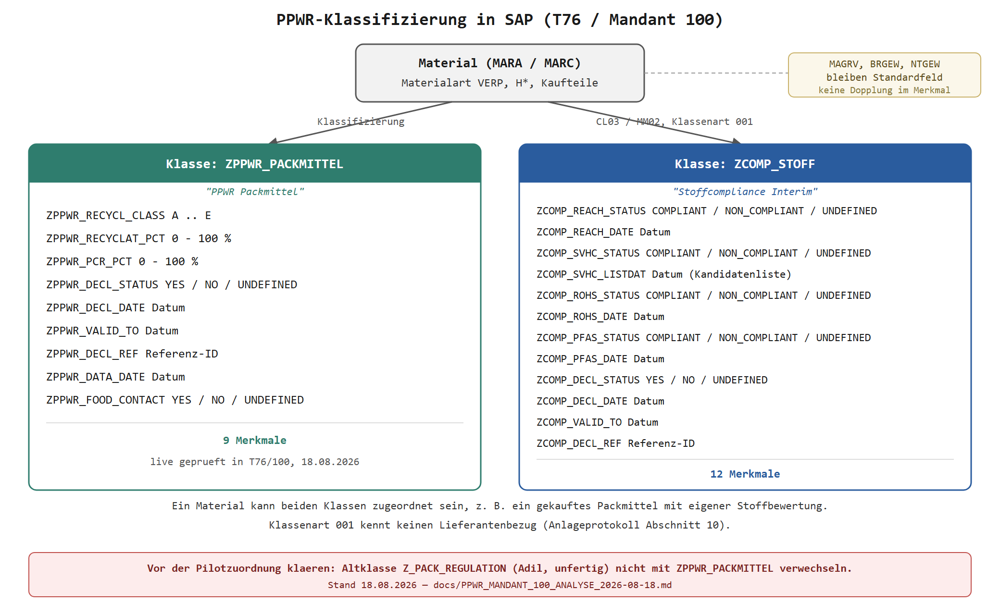

# PPWR-Klassifizierung in T76 Mandant 100 – Analyse und Korrektur

Stand: 18.08.2026
Zielsystem: **T76, Mandant 100** (bisher 090)
Status: Codekorrektur fertig, **Live in T76/100 nachgewiesen angelegt**. Offen: unabhaengige
Sichtpruefung in `CL03`/`CT04`, Pilotzuordnung.

Vorgaengerdokument: `docs/PPWR_SAP_KLASSIFIZIERUNG_ANLAGEPROTOKOLL_2026-08-13.md`.
Die fachliche Loesung — zwei Klassen der Klassenart `001`, 21 Merkmale, dreiwertige
Statuswerte — gilt unveraendert weiter. Dieses Dokument aendert nur den Zielmandanten und
behebt einen Fehler in der Anlagemechanik.



Quelle des Diagramms: `docs/img/PPWR_Klassendiagramm_2026-08-18.svg`.

## 1. Anlass

Ingo hat am 18.08.2026 zwei Dinge gemeldet:

1. In T76/090 wurden **keine Klassen angelegt**, obwohl das Anlageprotokoll vom 13.08.2026
   den Lauf als erfolgreich fuehrt.
2. Mandant 090 traegt ohnehin **keine Daten**. Gearbeitet wird in T76 Mandant 100 (Test)
   und spaeter in P76 (Produktion). Der Pilot gehoert deshalb nach 100.

## 2. Befund am Quelltext

Der Fehler ist im Report `docs/abap/ZPPWR_CLASS_SETUP.abap` nachweisbar, ohne dass dafuer
das System befragt werden muss.

Die Merkmalsanlage hatte bereits ein bekanntes Problem. Abschnitt 14 Punkt 1 des
Anlageprotokolls haelt fest, dass `BAPI_CHARACT_EXISTENCECHECK` bei einem **nicht**
vorhandenen Merkmal in diesem System keinen auswertbaren Fehler vom Typ `E` oder `A`
zurueckgab. Eine Pruefung nur ueber die Return-Tabelle fuehrte deshalb faelschlich zu
`SKIP Merkmal vorhanden`. Dafuer wurde eine Korrektur eingebaut: Die Merkmalspruefung
laeuft seither ueber einen direkten `SELECT` auf `CABN`.

**Fuer die Klassen wurde dieselbe Korrektur nie nachgezogen.** Die urspruengliche Fassung
von `create_class` prueft ausschliesslich ueber `BAPI_CLASS_EXISTENCECHECK`:

```abap
gv_exists = 'X'.                        " Vorbelegung: Klasse gilt als vorhanden
LOOP AT gt_return INTO gs_return.
  IF gs_return-type = 'E' OR gs_return-type = 'A'.
    CLEAR gv_exists.                    " nur ein echter Fehler widerlegt das
  ENDIF.
ENDLOOP.

IF gv_exists = 'X'.
  WRITE: / 'SKIP Klasse vorhanden:', iv_class.
  RETURN.                               " BAPI_CLASS_CREATE wird nie erreicht
ENDIF.
```

Verhaelt sich `BAPI_CLASS_EXISTENCECHECK` wie sein Merkmals-Gegenstueck, dann bleibt
`gv_exists` auf `X`, der Report meldet `SKIP Klasse vorhanden` und ruft `BAPI_CLASS_CREATE`
nie auf. Anschliessend laeuft er in den Erfolgszweig und schreibt
`FERTIG: Merkmale und Klassen angelegt/geprueft.`

Das erklaert den gemeldeten Widerspruch vollstaendig: Erfolgsmeldung ohne Klasse.

## 3. Warum der Nachweis vom 13.08. nicht traegt

Das Anlageprotokoll fuehrt als technischen Nachweis die Schlussausgabe des Reports an,
also **die Selbstmeldung des fehlerhaften Programms**. Eine unabhaengige Kontrolle hat nie
stattgefunden: Abschnitt 9 verlangt `CL03 zeigt beide Klassen`, Abschnitt 12 fuehrt genau
diesen Punkt aber als `offen — noch nicht ausgefuehrt`.

Das ist derselbe Fehlertyp, den `router.md` als Vorrangregel 1 fuehrt. Ein Programm, das
sein eigenes Ergebnis meldet, ist kein Beleg. Belegt haette nur eine Tabellen- oder
`CL03`-Abfrage nach dem Lauf.

Der vorhandene Preflight-Log `.tmp_sap_probe/ppwr_preflight.log` widerlegt oder bestaetigt
nichts, denn er stammt vom 13.08.2026 um 14:56 und damit **vor** dem Anlagelauf. Er zeigt
`CABN` fuer `ZPPWR%` und `ZCOMP%` leer, also den Ausgangszustand.

## 4. Was am Report geaendert wurde

| Aenderung | Zweck |
| --- | --- |
| Systemsperre `T76/090` auf `T76/100` umgestellt | Pilot laeuft im Testmandanten mit echten Materialien; P76 bleibt weiterhin hart gesperrt |
| `create_class` prueft ueber `SELECT SINGLE clint FROM klah WHERE klart = '001' AND class = ...` statt ueber `BAPI_CLASS_EXISTENCECHECK` | beseitigt das stille Ueberspringen der Klassenanlage |
| neue `FORM verify_counts` | zaehlt nach dem Commit aus `CABN`, `KLAH` und `KSML`, was wirklich in der Datenbank steht |
| Schlussmeldung an die Messung gekoppelt | `FERTIG` erscheint nur noch, wenn Ist gleich Soll ist; sonst `WARNUNG` mit dem ausdruecklichen Hinweis, den Lauf nicht weiterzumelden |
| Prueflauf ohne `P_WRITE` zeigt jetzt ebenfalls den Iststand | der Bestand eines Mandanten laesst sich ansehen, ohne etwas zu schreiben |

Sollzahlen der Kontrolle: 9 Merkmale `ZPPWR*`, 12 Merkmale `ZCOMP*`, 2 Klassen, und je
Klasse die passende Zahl zugeordneter Merkmale in `KSML`.

Nicht geaendert wurden der Merkmalskatalog, die Wertelisten, die Klassennamen und die
fachlichen Festlegungen aus dem Anlageprotokoll.

## 5. Ausstehende Live-Messung

Neu angelegt: `.tmp_sap_probe/RunPpwrStatusCheckInteractive.ps1`. Das Skript ist
**ausschliesslich lesend** und misst fuer die Mandanten 090 und 100:

- `CABN` fuer `ZPPWR%` und `ZCOMP%` — welche Merkmale existieren wirklich;
- `KLAH` fuer `Z*` in Klassenart `001` — welche Klassen existieren wirklich;
- die DDIC-Feldlisten von `KLAH` und `KSML`, damit keine Feldnamen geraten werden;
- zum Schluss `abap-check ZPPWR_CLASS_SETUP --source-file` gegen den geaenderten lokalen
  Quelltext, also eine Syntaxpruefung im System **ohne** Schreibzugriff.

Aufruf, Passwort wird maskiert abgefragt:

```
! powershell -NoProfile -ExecutionPolicy Bypass -File .tmp_sap_probe\RunPpwrStatusCheckInteractive.ps1
```

Protokoll landet in `.tmp_sap_probe/ppwr_status_100.log`.

Das Skript setzt bewusst `$ErrorActionPreference = 'Continue'` und faengt jeden Aufruf ab.
Der Preflight vom 13.08. lief mit `Stop` und brach beim letzten Aufruf mitten im Transkript
ab; dieser Fehler ist damit vermieden.

## 6. Offene Frage zur Mandantenabhaengigkeit

Diese Frage entscheidet, wie viel in Mandant 100 ueberhaupt noch anzulegen ist, und wird
**durch die Messung aus Abschnitt 5 beantwortet**, nicht durch Annahme:

- Sind die Merkmale mandantenuebergreifend, erscheinen die 21 Eintraege in **beiden**
  Mandanten. Der Report meldet in 100 dann `SKIP Merkmal vorhanden` und legt nur noch die
  beiden Klassen an.
- Erscheinen sie nur in 090 oder in keinem Mandanten, legt der Report in 100 alles neu an.

Beide Faelle sind unkritisch, weil der Report idempotent ist. Die Messung entscheidet
lediglich, was im Protokoll als Ausgangslage steht.

## 7. Transport nach P76

Unveraendert gesperrt. Abschnitt 10 des Anlageprotokolls listet die fachlichen
Entscheidungen, die vorher fallen muessen, darunter die Kante Produkt zu Packmittel, der
Data Owner je Merkmal und die Behandlung von Mehrlieferantenbezug.

Zwei technische Punkte gehoeren zusaetzlich geklaert, bevor ein Transport ueberhaupt
sinnvoll ist:

1. Ob beim Anlagelauf ein Transportauftrag mitgeschrieben wurde. Der Report schreibt per
   BAPI und `BAPI_TRANSACTION_COMMIT` direkt; das Anlageprotokoll sagt nichts ueber einen
   Auftrag. Pruefbar in `SE01`/`SE09`.
2. Dass ein solcher Transport nur die Definition von Merkmalen und Klassen bewegt. Die
   Materialzuordnung mit ihren Werten ist Stammdatenpflege und wandert nicht mit.

## 8a. Vorgefundene Altklasse `Z_PACK_REGULATION`

Beim Sichten von `CL30N`/`CL03` in Mandant 100 (Klassenart `001`) ist am 18.08.2026 eine
weitere Klasse aufgefallen, die in keinem PPWR-Dokument bisher vorkommt:

| Schlagwort | Klasse | Klassenart |
| --- | --- | --- |
| `PPWR` | `Z_PACK_REGULATION` | `001` |
| `VERPACKUNGSVERORDNUNG PPWR` | `Z_PACK_REGULATION` | `001` |

Laut Ingo stammt das von Adil selbst: ein früherer, nicht fertiggestellter Ansatz zur
PPWR-Klassifizierung, bevor der in diesem Dokument und im Anlageprotokoll beschriebene Weg
über `ZPPWR_PACKMITTEL`/`ZCOMP_STOFF` entstand. Der Inhalt von `Z_PACK_REGULATION`
(Merkmale, Zuordnungen, ob überhaupt etwas daran fertig ist) wurde nicht geprüft.

**Entscheidung von Ingo, 18.08.2026:** Für den Pilot wird mit `ZPPWR_PACKMITTEL` /
`ZCOMP_STOFF` weitergearbeitet, nicht mit `Z_PACK_REGULATION`. Damit ist der fachliche Weg
gesetzt. Offen bleibt nur noch, was mit der Altklasse selbst geschieht.

**Vor Beginn der Pilotzuordnung (Abschnitt 11, Stefan/Patrik/Marc) sollte mit Adil geklärt
werden:**

- Ist `Z_PACK_REGULATION` endgültig aufgegeben, oder sollen Teile davon übernommen werden.
- Falls aufgegeben: soll die Klasse gelöscht oder nur unangetastet stehen gelassen werden,
  damit bei der operativen Zuordnung niemand versehentlich die falsche PPWR-Klasse wählt.
  Zwei Klassen mit dem Schlagwort „PPWR" nebeneinander sind eine reale Verwechslungsgefahr
  für Stefan, Patrik und Marc.
- Falls dort schon Materialien zugeordnet sind: das wäre ein zusätzlicher, bisher nicht
  dokumentierter Datenbestand, der vor der Pilotabnahme berücksichtigt werden müsste.

## 8. Naechste Schritte

| Nr. | Schritt | Wer | Status |
| --- | --- | --- | --- |
| 1 | Iststand 100 messen | Ingo | **erledigt 2026-08-18**, direkt per SE38-Lauf statt per SapProbe-Skript (siehe Abschnitt 5, das Skript scheiterte an fehlender interaktiver Eingabe in der Werkzeugumgebung) |
| 2 | Ergebnis hier in Abschnitt 9 nachtragen | Claude | **erledigt 2026-08-18** |
| 3 | Report in T76/100 einspielen und mit `P_WRITE = X` ausfuehren | Ingo | **erledigt 2026-08-18**, Ruecklesekontrolle bestaetigt Ist gleich Soll |
| 4 | Programmnamen klaeren (`ZTEST55` gegen `ZPPWR_CLASS_SETUP`) | Ingo / Adil | offen |
| 5 | Unabhaengige Sichtpruefung in `CL03` und `CT04` — Reihenfolge, Wertelisten, Bezeichnungen | Ingo / Adil | offen |
| 6 | `Z_PACK_REGULATION` mit Adil klaeren (Abschnitt 8a), vor Beginn von Schritt 7 | Adil | offen, blockierend fuer Schritt 7 |
| 7 | Pilotmaterialien zuordnen (`MM02`) und `CL30N`-Abnahme nach Abschnitt 9 des Anlageprotokolls | Einkauf/Marco fuer die Kandidatenliste, Stefan/Patrik/Marc fuer die Zuordnung | offen |
| 8 | Mandant-090-Frage aus Abschnitt 6 nur noch von historischem Interesse, da 100 jetzt der Zielmandant ist | – | gegenstandslos |

## 9. Messergebnis

Gemessen am 18.08.2026 durch Ingo, Ausfuehrung des korrigierten Reports mit `P_WRITE = X`
in T76/100 (Ausgabe unter dem Programmnamen `ZTEST55` protokolliert, siehe Hinweis am Ende
dieses Abschnitts). Der Katalog- und Anlageteil lief unauffaellig durch, alle 21 Merkmale
und beide Klassen meldeten `wird angelegt`. Entscheidend ist die anschliessende
Ruecklesekontrolle aus der Datenbank, **nicht** diese BAPI-Meldungen selbst:

| Kennzahl | Ist | Soll | Ergebnis |
| --- | ---: | ---: | --- |
| Merkmale `ZPPWR*` in `CABN` | 9 | 9 | erfuellt |
| Merkmale `ZCOMP*` in `CABN` | 12 | 12 | erfuellt |
| Klassen in `KLAH` (Klassenart `001`) | 2 | 2 | erfuellt |
| Merkmale an `ZPPWR_PACKMITTEL` in `KSML` | 9 | 9 | erfuellt |
| Merkmale an `ZCOMP_STOFF` in `KSML` | 12 | 12 | erfuellt |

Schlussmeldung: `FERTIG: Anlage in der Datenbank nachgewiesen.`

**Damit ist belegt, und zwar durch eine echte Tabellenzaehlung und nicht durch eine
Selbstmeldung:** Beide Klassen `ZPPWR_PACKMITTEL` und `ZCOMP_STOFF` sowie alle 21 Merkmale
existieren in T76 Mandant 100, und jede Klasse traegt genau die vorgesehene Anzahl
zugeordneter Merkmale. Der am 13.08.2026 in Mandant 090 aufgetretene Fehler (Klassen trotz
Erfolgsmeldung nicht angelegt) ist damit fuer Mandant 100 nicht erneut aufgetreten; die
Korrektur der Existenzpruefung in Abschnitt 4 wirkt.

Was diese Zahlen **nicht** pruefen: die korrekte Reihenfolge der Merkmale je Klasse, die
Werteliste und Intervallgrenzen je Merkmal sowie die deutsche Bezeichnung. Das sind genau
die Punkte aus Abschnitt 9 des Anlageprotokolls (`CL03` zeigt beide Klassen mit den
richtigen Merkmalen und Reihenfolgen; `CT04` zeigt bei jedem Statusmerkmal nur die
freigegebenen Werte). Diese Sichtpruefung steht weiterhin aus.

Offener Punkt zum Protokoll: Die Ausgabe zeigt in der Kopfzeile `Report ZTEST55` statt
`ZPPWR_CLASS_SETUP`. Fuer die Datenbankwirkung ist das ohne Bedeutung, die BAPIs kennen den
aufrufenden Programmnamen nicht. Zu klaeren ist nur, ob der Quelltext testweise unter einem
Hilfsnamen ausgefuehrt wurde oder ob `ZPPWR_CLASS_SETUP` selbst umbenannt ist; fuer einen
spaeteren Wiederholungslauf oder einen Transport nach P76 sollte der endgueltige
Programmname eindeutig feststehen.
